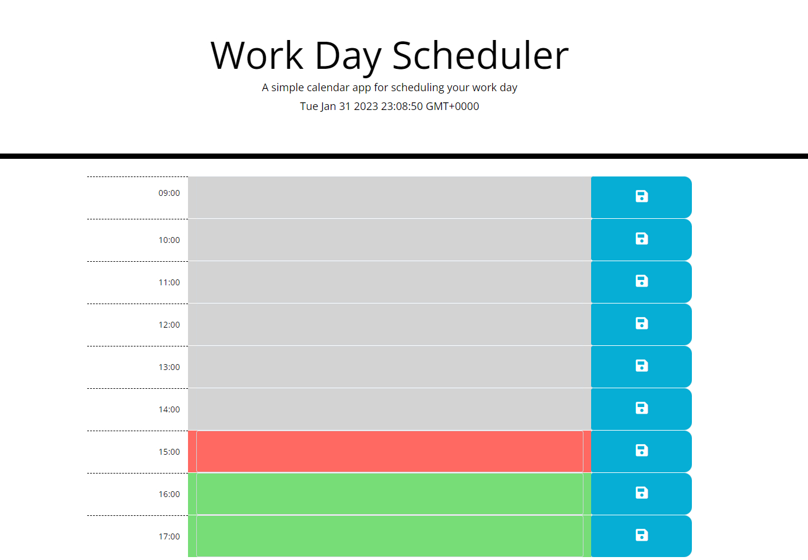

# Daily-Planner
A daily planner, set from 0900 to 1700 (typical working hours), built using jQuery.

## Deployed Application
[Daily Planner](https://benedictcodeshere.github.io/Daily-Planner/)

## Description
This application is designed for a person who works from 0900 to 1700, split into hour blocks. It displays the current time, highlights the current hour in red, future hours in green, and past hours in grey. The user can type in the colored boxes, and save their text 
in localStorage, so their appointment is saved and persists past browser refresh.

## Installation

N/A

## Usage

The way to use the deployed application is to:
1. Type in one of the colored boxes (if you want to create an appointment for that hour block)
2. Click the save button to the right of the colored box.

## Screenshot Of Deployed Application

## Credits

N/A

## License

Please refer to the license in the repo (MIT License).